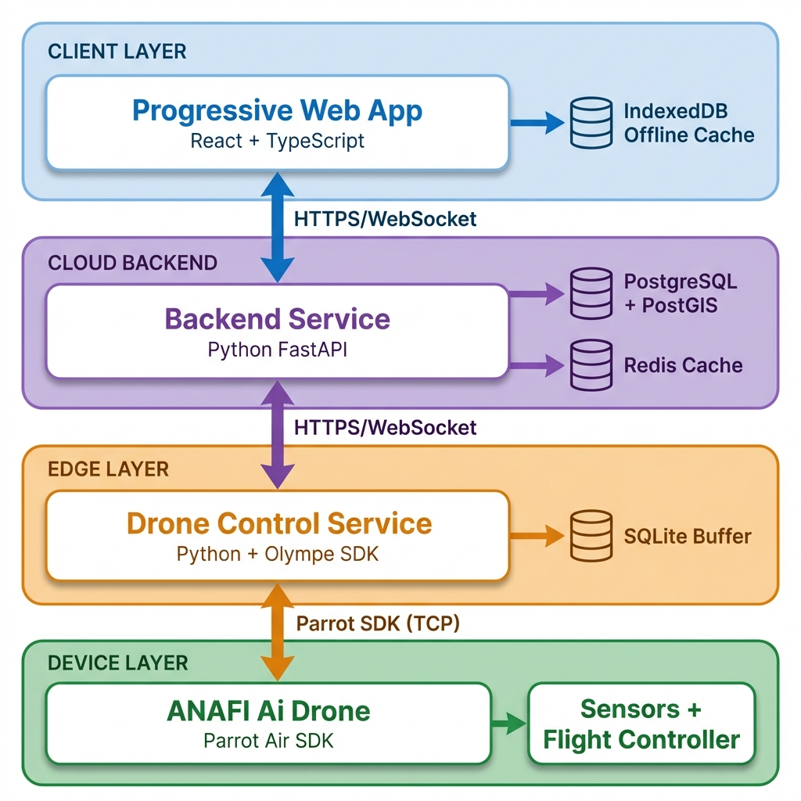
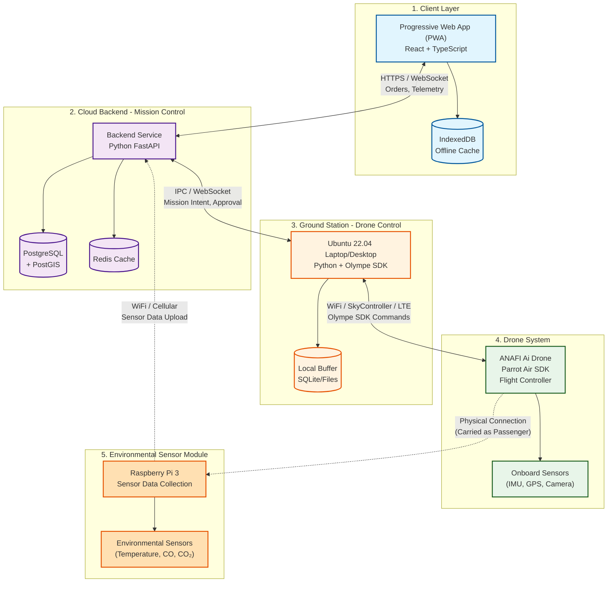

# EcoDrone System Architecture

## High-Level Architecture Diagram



*Visual representation of the 4-layer architecture showing communication flows between components.*

---

## Architecture Overview

The EcoDrone system follows a **4-layer architecture** with clear separation of concerns:



---

## Component Responsibilities

| Layer | Component | Technology | Responsibilities |
|-------|-----------|------------|------------------|
| **Client** | PWA | React + TypeScript | Order placement, status display, telemetry visualization |
| **Cloud** | Backend | FastAPI + PostgreSQL | Order management, mission authorization, sensor data aggregation, audit logging |
| **Ground Station** | Drone Control | Ubuntu 22.04 + Python + Olympe SDK | Fetch missions, compile flight plans, send commands to drone via WiFi/LTE, monitor safety |
| **Drone** | ANAFI Ai | Air SDK + Flight Controller | Execute mission autonomously, obstacle avoidance, failsafe RTL, collect flight telemetry |
| **Sensor Module** | Raspberry Pi 3 | Python + Environmental Sensors | Collect temperature, CO, CO₂ data during flight, transmit to backend independently |

---

## Architectural Principles

> [!IMPORTANT]
> **Critical Design Rules**
> 
> 1. **No browser or cloud component directly controls motors** - All offboard components are supervisors, not pilots
> 2. **Drone can complete/abort mission without network** - Autonomous continuation during connectivity loss
> 3. **One authoritative mission state: onboard the drone** - Single source of truth for mission execution
> 4. **All offboard components are supervisors, not pilots** - No remote motor-level control
> 5. **Safety logic always overrides business logic** - Air SDK has final authority on safety

---

## Communication Protocols

### Inter-Component Communication

| Connection | Protocol | Data Types | Purpose |
|------------|----------|------------|---------|
| PWA ↔ Backend | HTTPS, WebSocket | Orders, status updates, telemetry | User interface communication |
| Backend ↔ Ground Station | IPC / WebSocket | Mission intent, approval, state transitions | Mission coordination |
| Ground Station ↔ Drone | WiFi / SkyController / LTE + Olympe SDK | Mission upload, start/stop, GPS, battery, state | Direct drone control |
| Raspberry Pi 3 ↔ Backend | WiFi / Cellular (independent) | Temperature, CO, CO₂ sensor data | Environmental data collection |
| Drone ↔ Raspberry Pi 3 | Physical transport (no data link) | N/A | Pi carried as passenger payload |

### Communication Range Architecture

1. **WiFi Direct** (Primary, Limited Range ~300m)
   - Drone creates WiFi network
   - Ground station connects via Olympe
   - Direct, low-latency control

2. **SkyController Extension** (Line of Sight ~2-4km)
   - Manual flight controller acts as relay
   - Extends range while maintaining line of sight
   - Still uses Olympe SDK protocol

3. **LTE/4G** (Extended Range, Beyond Line of Sight)
   - Drone uses onboard SIM card
   - Communicates via cellular network
   - Enables campus-wide operations

### Data Flow Direction

```
Customer Order → PWA → Backend → Ground Station → Drone → Execution
                         ↑                                    ↓
        Sensor Data ← Raspberry Pi 3 (carried as passenger) ←─┘
```

---

## Failure Handling Matrix

> [!WARNING]
> **Resilience Strategy**
> 
> The system is designed to handle failures gracefully at each layer

| Scenario | Outcome | Recovery Strategy |
|----------|---------|-------------------|
| Backend offline | Drone Control continues mission | Buffering and eventual consistency |
| Drone Control offline | Air SDK completes or aborts mission | Onboard autonomy with failsafe RTL |
| Network loss mid-flight | Air SDK continues autonomously | Mission completes based on uploaded plan |
| Safety violation | Air SDK overrides all commands | Immediate failsafe activation (land/RTL) |
| Battery critical | Air SDK returns to launch | Emergency power management |
| Geofence breach | Air SDK halts or returns | Boundary enforcement |

---

## Layer Details

### 1. Client Layer (PWA)

**Purpose**: User interface for customers and administrators

**Technology Stack**:
- React + TypeScript
- PWA Service Workers (offline capability)
- IndexedDB (local caching)
- Mapbox GL JS / OpenLayers (mapping)

**Key Features**:
- Order placement and tracking
- Real-time telemetry visualization
- Environmental data display
- Offline order queuing

**Out of Scope**:
- Direct drone communication
- Flight logic
- Safety enforcement

---

### 2. Cloud Layer (Backend - Mission Control)

**Purpose**: System of record and mission authorization authority

**Technology Stack**:
- Python FastAPI (async web framework)
- PostgreSQL + PostGIS (spatial database)
- Redis (state cache & pub/sub)
- WebSocket server (real-time communication)

**Key Responsibilities**:
- Order lifecycle management
- Mission authorization and assignment
- Constraint validation (payload, distance, zones)
- Telemetry aggregation (non-authoritative)
- Audit logging and analytics

> [!WARNING]
> **Critical Rule**: The backend NEVER communicates directly with the drone

---

### 3. Ground Station (Drone Control)

**Purpose**: Ground-based mission supervisor and drone command center

**Hardware**:
- Ubuntu 22.04 Laptop or Desktop (Linux machine)
- Reliable power supply
- WiFi/LTE connectivity
- Optional: SkyController for range extension

**Technology Stack**:
- Python 3
- Parrot Olympe SDK
- Local buffering (SQLite / filesystem)

**Key Responsibilities**:
- Authenticate with backend
- Fetch and acknowledge approved missions from PWA
- Compile missions into drone-executable flight plans
- Upload missions to drone via Olympe SDK (WiFi/LTE)
- Monitor real-time telemetry and safety signals
- Start, pause, or abort missions
- Buffer telemetry during connectivity loss

**Communication Methods**:
1. **IPC with PWA**: Inter-process communication for mission approval
2. **Olympe to Drone**: Commands and telemetry via WiFi/SkyController/LTE
3. **WebSocket to Backend**: State updates and logging

**Out of Scope**:
- Motor-level control (handled by Air SDK)
- Low-level navigation (handled by drone)
- Environmental sensors (handled by Raspberry Pi 3)
- Autonomous mission decisions (handled by drone Air SDK)

---

### 4. Drone System (ANAFI Ai)

**Purpose**: Autonomous flight executor with failsafe authority

**Hardware**:
- Parrot ANAFI Ai quadcopter
- Onboard Linux system + Air SDK
- GPS, IMU, barometer
- Obstacle avoidance sensors (cameras, stereo vision)
- Onboard SIM card for LTE connectivity
- Delivery container attachment point
- Raspberry Pi 3 mounting bracket (payload)

**Technology**:
- Parrot Air SDK (onboard autonomous flight)
- Navigation and path planning
- Obstacle detection and avoidance
- WiFi AP for ground station connection
- 4G/LTE modem for extended range

**Key Responsibilities**:
- Execute uploaded mission plan autonomously
- Maintain authoritative mission state (single source of truth)
- Perform real-time obstacle avoidance
- Enforce geofencing and altitude limits
- Execute failsafes (RTL - Return to Launch, emergency land, loiter)
- Continue mission completion during connectivity loss
- Transport delivery container and Raspberry Pi 3 sensor module
- Report flight telemetry (battery, GPS, altitude, status)

**Onboard Sensors (Drone-Specific)**:
- **NOT** environmental sensors (temp, CO, CO₂)
- IMU (Inertial Measurement Unit)
- GPS/GNSS
- Barometer (altitude)
- Cameras (obstacle avoidance, visual positioning)
- Battery monitoring

> [!CAUTION]
> **Authority Rule**: Air SDK safety logic overrides ALL external commands

---

### 5. Environmental Sensor Module (Raspberry Pi 3)

**Purpose**: Independent environmental data collection during flight

**Hardware**:
- Raspberry Pi 3
- Temperature sensor
- CO (Carbon Monoxide) sensor
- CO₂ (Carbon Dioxide) sensor
- Power supply (battery pack)
- WiFi/Cellular connectivity module
- Mounting system (attached to drone as payload)

**Technology**:
- Python 3
- Sensor interfacing libraries (I2C/SPI)
- Data logging (local storage)
- WiFi/Cellular communication

**Key Responsibilities**:
- Collect environmental sensor readings during flight
- Timestamp and geo-tag data (from own GPS or via sync)
- Store data locally (resilient to connectivity loss)
- Transmit data to backend when connectivity available
- Operate independently from drone control system

**Relationship to Drone**:
- **Physical**: Carried as passenger payload (no control interface)
- **Logical**: Independent system ("climate scientist on board")
- **Data**: No direct communication with drone systems
- **Power**: Independent battery (does not drain drone battery)

> [!NOTE]
> **Independence**: The Raspberry Pi 3 sensor module is a separate system from the drone. It does not interface with drone sensors or control systems. It simply rides along and collects environmental data independently.

---

## Design Philosophy

> [!NOTE]
> **System Authority Model**
> 
> - The **Backend** decides what should happen (business logic)
> - The **Raspberry Pi** supervises how it is initiated (orchestration)
> - The **Drone** decides how it survives and completes the mission (execution authority)

---

## Related Documentation

- [Design Document](Design%20Document.md) - Complete technical specification
- [Mission Lifecycle](mission_lifecycle.md) - Detailed order-to-delivery flow (coming soon)
- [API Documentation](api_spec.md) - Backend API endpoints (coming soon)
- [Security Model](security_model.md) - Authentication and authorization (coming soon)
