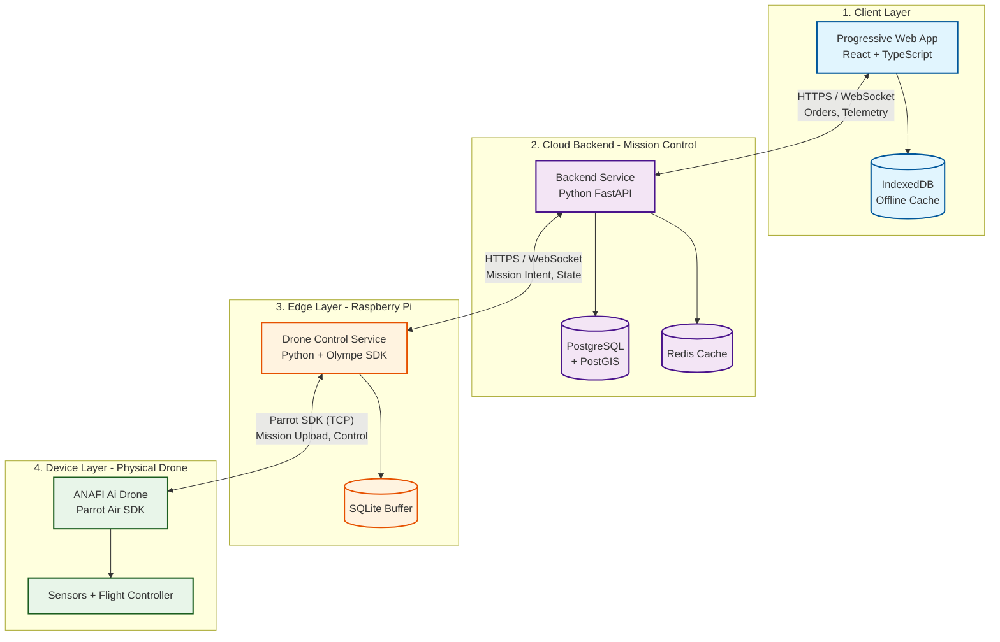

# EcoDrone System Architecture

## High-Level Architecture Diagram


*Visual representation of the 4-layer architecture showing communication flows between components.*

---

## Architecture Overview

The EcoDrone system follows a **4-layer architecture** with clear separation of concerns:



---

## Component Responsibilities

| Layer | Component | Technology | Responsibilities |
|-------|-----------|------------|------------------|
| **Client** | PWA | React + TypeScript | Order placement, status display, telemetry visualization |
| **Cloud** | Backend | FastAPI + PostgreSQL | Order management, mission authorization, audit logging |
| **Edge** | Drone Control | Python + Olympe | Fetch missions, compile, upload to drone, monitor safety |
| **Device** | ANAFI Ai | Air SDK | Execute mission, obstacle avoidance, failsafe autonomy |

---

## Architectural Principles

> [!IMPORTANT]
> **Critical Design Rules**
> 
> 1. **No browser or cloud component directly controls motors** - All offboard components are supervisors, not pilots
> 2. **Drone can complete/abort mission without network** - Autonomous continuation during connectivity loss
> 3. **One authoritative mission state: onboard the drone** - Single source of truth for mission execution
> 4. **All offboard components are supervisors, not pilots** - No remote motor-level control
> 5. **Safety logic always overrides business logic** - Air SDK has final authority on safety

---

## Communication Protocols

### Inter-Component Communication

| Connection | Protocol | Data Types | Purpose |
|------------|----------|------------|---------|
| PWA ↔ Backend | HTTPS, WebSocket | Orders, status updates, telemetry | User interface communication |
| Backend ↔ Drone Control | HTTPS, WebSocket | Mission intent, state transitions, abort commands | Mission coordination |
| Drone Control ↔ Drone | Parrot SDK (TCP) | Mission upload, start/stop, GPS, battery, state | Direct drone control |

### Data Flow Direction

```
Customer Order → PWA → Backend → Drone Control → Drone → Execution → Telemetry → Backend → PWA → Customer
```

---

## Failure Handling Matrix

> [!WARNING]
> **Resilience Strategy**
> 
> The system is designed to handle failures gracefully at each layer

| Scenario | Outcome | Recovery Strategy |
|----------|---------|-------------------|
| Backend offline | Drone Control continues mission | Buffering and eventual consistency |
| Drone Control offline | Air SDK completes or aborts mission | Onboard autonomy with failsafe RTL |
| Network loss mid-flight | Air SDK continues autonomously | Mission completes based on uploaded plan |
| Safety violation | Air SDK overrides all commands | Immediate failsafe activation (land/RTL) |
| Battery critical | Air SDK returns to launch | Emergency power management |
| Geofence breach | Air SDK halts or returns | Boundary enforcement |

---

## Layer Details

### 1. Client Layer (PWA)

**Purpose**: User interface for customers and administrators

**Technology Stack**:
- React + TypeScript
- PWA Service Workers (offline capability)
- IndexedDB (local caching)
- Mapbox GL JS / OpenLayers (mapping)

**Key Features**:
- Order placement and tracking
- Real-time telemetry visualization
- Environmental data display
- Offline order queuing

**Out of Scope**:
- Direct drone communication
- Flight logic
- Safety enforcement

---

### 2. Cloud Layer (Backend - Mission Control)

**Purpose**: System of record and mission authorization authority

**Technology Stack**:
- Python FastAPI (async web framework)
- PostgreSQL + PostGIS (spatial database)
- Redis (state cache & pub/sub)
- WebSocket server (real-time communication)

**Key Responsibilities**:
- Order lifecycle management
- Mission authorization and assignment
- Constraint validation (payload, distance, zones)
- Telemetry aggregation (non-authoritative)
- Audit logging and analytics

> [!WARNING]
> **Critical Rule**: The backend NEVER communicates directly with the drone

---

### 3. Edge Layer (Drone Control - Raspberry Pi)

**Purpose**: Safety-aware supervisor for a single drone

**Hardware**:
- Raspberry Pi 4 or newer
- Ubuntu Server / Raspberry Pi OS (64-bit)
- Reliable power and networking

**Technology Stack**:
- Python 3
- Parrot Olympe SDK
- SQLite (local buffering)

**Key Responsibilities**:
- Authenticate with backend
- Fetch and acknowledge missions
- Compile missions into executable flight plans
- Upload missions to drone via Air SDK
- Monitor telemetry and safety signals
- Buffer data during outages

**Out of Scope**:
- Motor control
- Low-level navigation
- Autonomous decision-making

---

### 4. Device Layer (ANAFI Ai Drone)

**Purpose**: Authoritative executor with failsafe autonomy

**Hardware**:
- Parrot ANAFI Ai quadcopter
- Onboard Linux system
- GPS, IMU, obstacle avoidance sensors
- Environmental sensors (temp, CO, CO₂)

**Technology**:
- Parrot Air SDK (onboard)
- Navigation stack
- Obstacle avoidance

**Key Responsibilities**:
- Execute uploaded mission plan
- Maintain authoritative mission state
- Perform obstacle avoidance
- Enforce geofencing and altitude limits
- Execute failsafes (RTL, land, loiter)
- Continue mission during connectivity loss

> [!CAUTION]
> **Authority Rule**: Air SDK safety logic overrides ALL external commands

---

## Design Philosophy

> [!NOTE]
> **System Authority Model**
> 
> - The **Backend** decides what should happen (business logic)
> - The **Raspberry Pi** supervises how it is initiated (orchestration)
> - The **Drone** decides how it survives and completes the mission (execution authority)

---

## Related Documentation

- [Design Document](Design%20Document.md) - Complete technical specification
- [Mission Lifecycle](mission_lifecycle.md) - Detailed order-to-delivery flow (coming soon)
- [API Documentation](api_spec.md) - Backend API endpoints (coming soon)
- [Security Model](security_model.md) - Authentication and authorization (coming soon)
